# Pointing Site via PointDNS

## Why PointDNS ?
By Default Heroku supports CNAME records only. CNAME record does not require hard-coded IP addresses and allows Heroku to manage the set of IPs associated with your domain. However, CNAME records are not available at the zone apex and can’t be used to configure root domains.

Heroku doesn’t support DNS A-records and does not provide hard-coded IP addresses which are required for A-records DNS. This prevents your infrastructure provider from assigning your app a new IP address on your behalf when adverse conditions arise and can have a serious impact on your app’s uptime.

PointDNS add-on provide us the facility to add A-records DNS on Heroku app.

## Step 1
Export Zone records from DNS panel (just for reference) : In Godaddy we have the option to export Zone records for unix / windows, export in either way so that we can save it for case if we need to revert those records.

## Step 2
Consider ```funGyaan.com``` as our target domain for all the steps. Change ```funGyaan.com``` with your domain name.

Run following steps to add domain to be pointed to production app via CLI:

    heroku login
    heroku domains:add www.funGyaan.com -a productionAppName
    heroku domains:add funGyaan.com -a productionAppName
    heroku domains -a productionAppName

```Last command is to verify and can be skipped```

## Step 3

1. Add ‘PointDNS’ add-on heroku in the production app.

    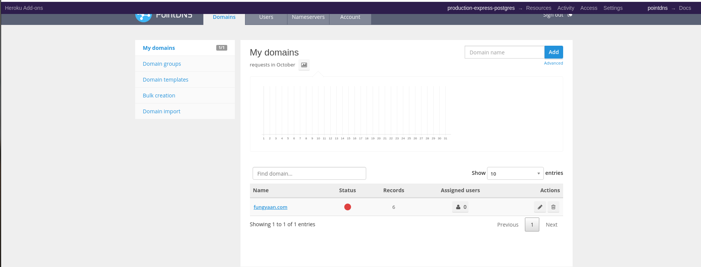

2. When clicked on PointDNS this will automatically start showing the sitename(s) added on Step 2B and Step 2C (as shown in above image).

    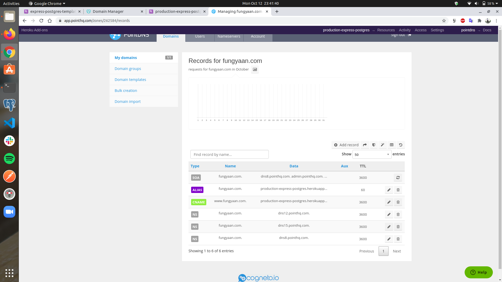

3. If the domain isn’t there, then do following steps:


    1. Write funGyaan.com in top right corner of screen and click on ```Add```

        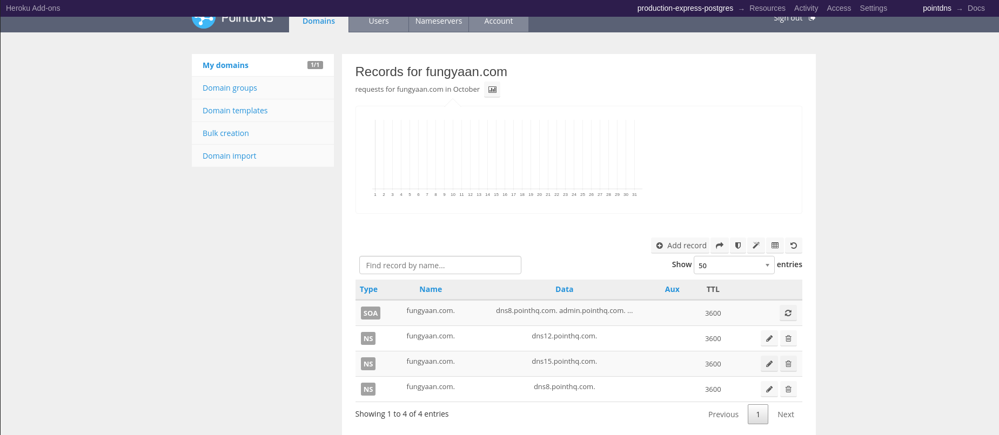

    2. Click on ```Add Record``` for adding CNAME

        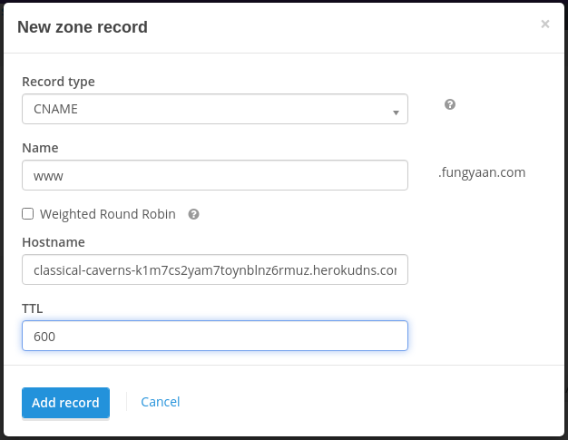

        1. Write the following and click in ```Add record```
            ```
            Record type     CNAME
            Name            www
            Hostname        xxxxx.herokuapp.com.
            TTL             600
            ```
            Replace ```xxxxx.herokuapp.com``` with the DNS Target value next to ```www.funGyaan.com```
        2. If the above step gives an error that ```Name has already been taken```, then write any random sub-domain name and Save the record
        3. Now delete the CNAME record added in previous step
        4. Edit the CNAME record with values in first step
    3. Click on ```Add Record``` for adding ALIAS

        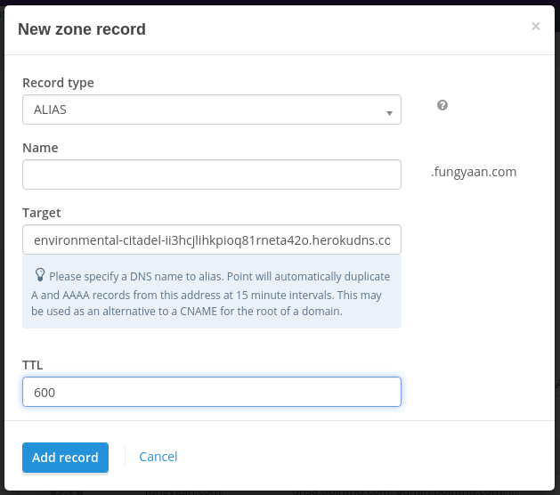

        1. Write the following and click in ```Add record```
            ```
            Record type     ALIAS
            Name            
            Hostname        xxxxx.herokuapp.com.
            TTL             600
            ```
            Replace ```xxxxx.herokuapp.com``` with the DNS Target value next to ```funGyaan.com```
    4. Configuring SSL (Optional)
        1. Get a free SSL for your domain name (e.g. from www.sslforfree.com)
        2. Download the zip containing ```ca_bundle.crt```, ```certificate.crt``` and ```private.key```
        3. Upgrade dyno to Hobby or above
        4. Click on Configure SSL
        5. If there is already some SSL configured, click on ```Remove SSL```. Else skip this step
        6. Click on ```Manual Certificate```
        7. Drag and drop certificate.crt in public certificate section
        8. Drag and drop private.key in private key section
        9. Click on ```Next```
        10. If the SSL matches the already added domains, it'll say ```Your SSL certificate is now setup```

        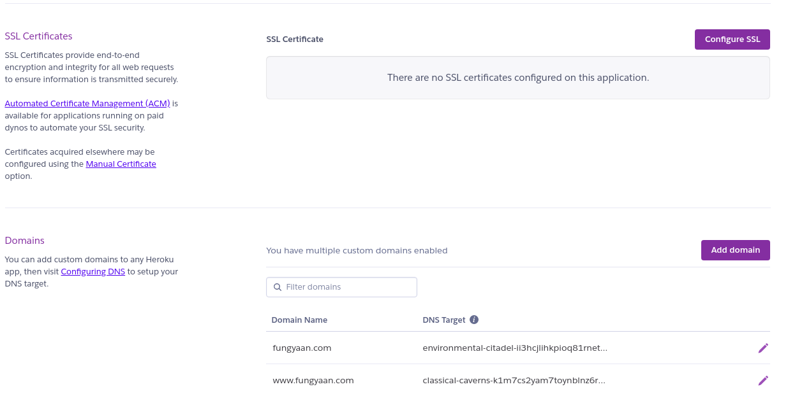
        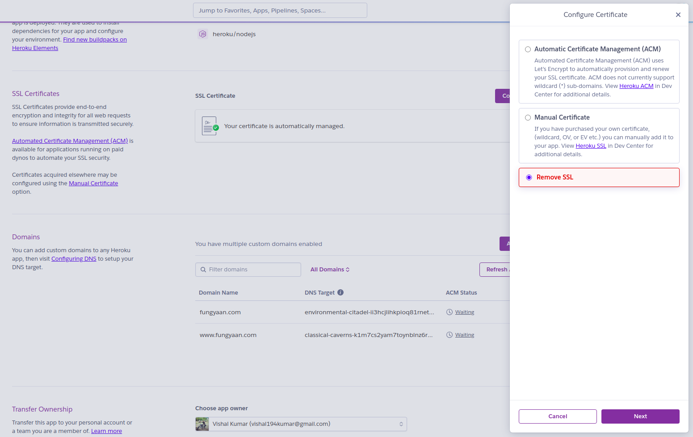
        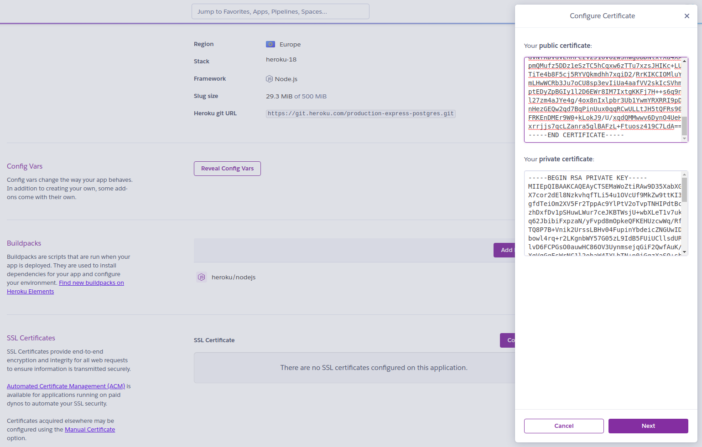
        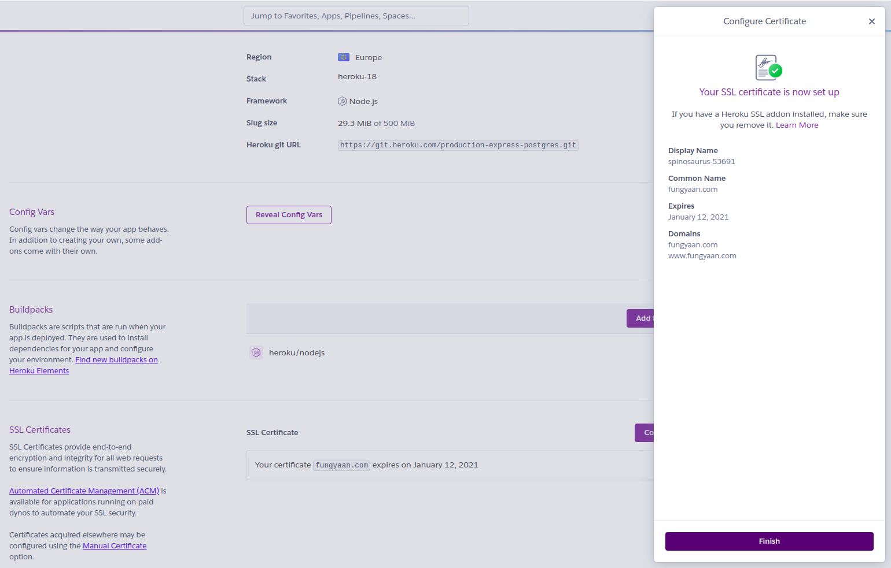

## Step 4
Add all the records from Domain Name Registrar to PointDNS (there are some record which needs be entered in different format, so read the placeholder test carefully in PointDNS).
> Skip this step, if there isn't any record

## Step 5
Just to make sure, compare the added records on PointDNS with the exported file in Step 1.

## Step 6
Update the NameServer on Domain Name Registrar by replacing the original NS by PointDNS NS.
```
dns12.pointhq.com
dns15.pointhq.com
dns8.pointhq.com
dns14.pointhq.com
```
> there are generally 3-4 NS provided by PointDNS

> But some Domain Name Registrars accept only 2 NS, so add the first two

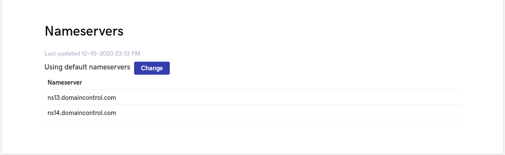
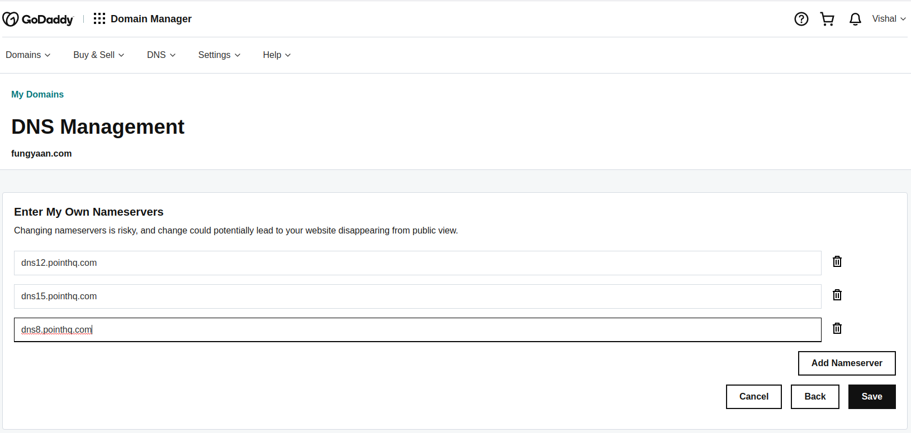


## Step 7
When a domain is newly registered, or the nameservers are changed, or DNS changes are made, you can expect a propagation time up to 48 hours. This is because it takes time for the DNS to take effect across the internet. The actual time of propagation may vary in some locations based on your network setup. Generally it would take 2-3 hours or less.

## Step 8
Visit PointDNS add-on and click on the dot next to domain name under the title status

> It will recheck the NS and if the status becomes green then everything went well while pointing

> Remember this will test the NS and not other records, so we need to verify them from client

## Step 9
Check the status on [DNS checker](https://dnschecker.org/)

> This will provide all the latest zone records except CNAME.

## Step 10
If the above url is showing pointDNS NS, then we have successfully updated the NS and rest of the records like MX can be confirmed from client as the email should work in same as was working before.

If this doesn't succeed we can revert the NS on domain name registrar just by importing the records that were exported in Step 1 and look into the possible errors that we may have made during the process.

So the possible issues can be:
- Adding wrong Zone records
- Services may be down on heroku end
- Taking more time than expected while updating NS records

> While making changes in NS, please check domain forwarding, masking or SSL.

> If SSL is already implemented on domain, then it must be uploaded and verified on the app or site where we are pointing the website/app to.